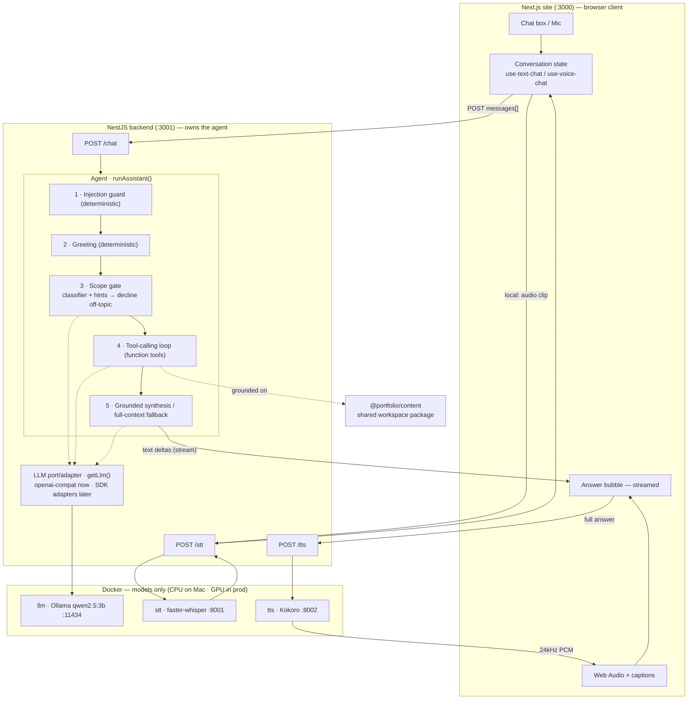

# Voice + chat assistant — architecture

End-to-end, from the UI (chat box or mic) to the spoken/printed answer. Reflects
the Phase 1 build: a container-only model stack, a provider port/adapter, and a
function-tools agent loop with a scope gate.

## Where the "backend" is

The backend is a **dedicated NestJS service** (`backend/`, `@portfolio/backend`)
that owns the agent and orchestrates the model containers. It exposes
`POST /chat` (text stream), `POST /tts` (PCM stream), `POST /stt` (upload),
`GET /health`, and **`WS /voice`** — a full voice loop (audio → STT → agent →
TTS, streamed back as tokens + PCM), with keys server-side. The **Next.js site
is a browser client**
that calls it (`src/lib/backend.ts` → `NEXT_PUBLIC_BACKEND_URL`, default
`http://localhost:3001`). The profile data is a shared workspace package
(`@portfolio/content`) both consume. In dev the site (`:3000`) and backend
(`:3001`) run natively on the Mac; the three **models** run in Docker.

### WS /voice protocol

`client → server`: binary audio frames, then `{type:"end", mime}` (or
`{type:"text", content}` for a typed turn; `{type:"reset"}` to drop buffered
audio). `server → client`: `{type:"transcript"}` (STT result), `{type:"token"}`
(answer deltas), `{type:"speaking"}`, binary PCM frames (answer audio),
`{type:"audio_done"}`, `{type:"turn_done"}`, `{type:"error"}`. The server keeps
per-connection history for multi-turn voice. Client transport: `voice-socket.ts`
+ the `use-voice-socket` hook (drop-in for `use-voice-chat`).

## What it works from (the data)

The assistant may only use Aniket's profile — the single source of truth in the
`@portfolio/content` package (`profile`, `experience`, `skills`, `projects`).
`agents/context.ts` slices it per tool. The **function
tools are the only window onto the data**; the model is told to answer from tool
results, never from world knowledge. When the corpus outgrows context-stuffing,
a tool's body swaps to vector/keyword retrieval (RAG) with no change to the loop.

## Conversation state

- **Client** holds the multi-turn thread (`use-text-chat.ts` / `use-voice-chat.ts`)
  and streams each reply into the trailing assistant bubble.
- **Server** is stateless per request. `/api/chat` re-validates every turn:
  600-char cap, last 12 turns, final turn must be a user question.

## The agent loop (`agents/orchestrator.ts` · `runAssistant`)

1. **Injection guard** (`guardrail.ts`) — deterministic; refuses jailbreak/empty
   input with no model call.
2. **Greeting** — deterministic friendly reply for bare "hi/thanks".
3. **Scope gate** (`scope.ts`) — a one-word RELEVANT/UNRELATED classifier plus a
   deterministic regex for recruiter phrasings ("do you know…"). Off-topic is
   **declined here**, before any answer is attempted — this is what keeps the
   assistant from answering trivia or coding questions from world knowledge.
4. **Tool-calling loop** — the LLM is given the search tools and picks which to
   call (several at once for cross-topic questions); tools return grounded slices.
5. **Answer** — a streamed synthesis composes the reply from tool results. If the
   model misrouted (called no tool on an in-scope question), a full-context
   grounded fallback answers instead of falsely declining.

Tools are **functions**, not sub-agent LLM calls, so a turn is ~2 model calls
(+1 tiny classifier) — snappy enough on a CPU-only local model.

## Switches (`config.ts`) — all default free/local

| Switch | Env | Options (default **bold**) | Local container |
| --- | --- | --- | --- |
| Brain | `AI_PROVIDER` | **local** · openai · gemini | Ollama `:11434` (qwen2.5:3b) |
| Ears | `STT_PROVIDER` | **browser** · local | faster-whisper `:8001` |
| Mouth | `TTS_PROVIDER` | **local** · gemini | Kokoro `:8002` |

The LLM **port/adapter** (`llm/port.ts` + `llm/openai-compat.ts`) means one
adapter drives local/OpenAI/Gemini today; platform SDK adapters slot in behind
`LlmPort` later with no change to the agent.

## Wired flow

*(Next sub-phase adds `WS /voice` on the backend for a full-duplex audio loop.)*

**Legend** — solid arrows carry request/response data; dotted arrows are
grounding/provider calls. Everything in the 🐳 box is `docker-compose.yml`;
in the all-local configuration nothing leaves the machine.
